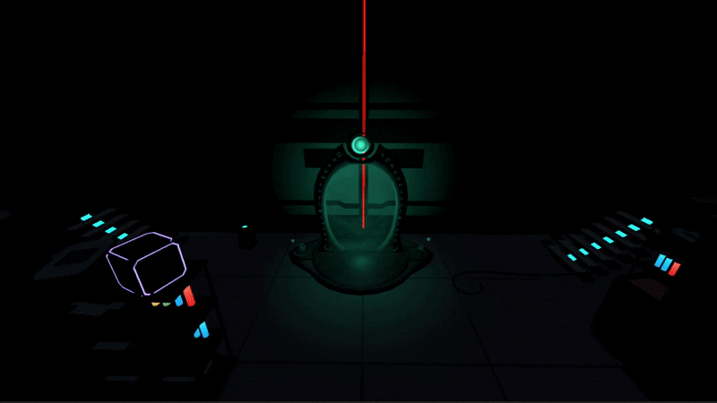
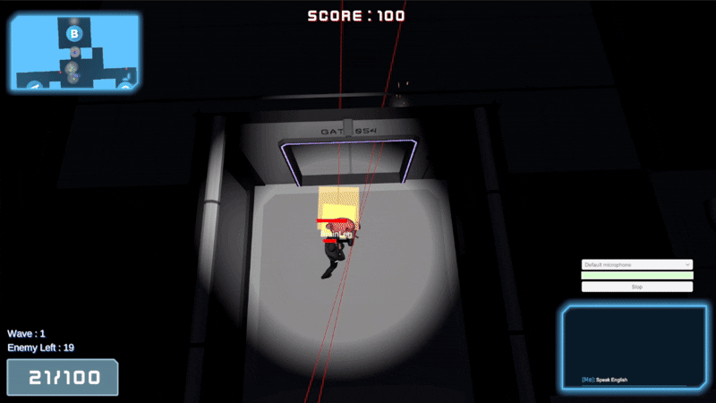
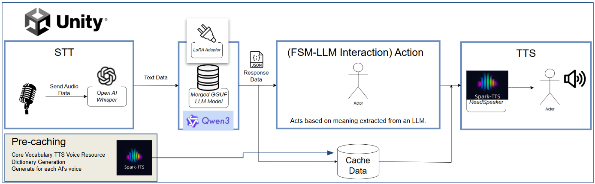

# EchoSquad

<div align="center">


</div>

<div align="center">
  
  <p><i>Boss monster appears - Face the ultimate challenge</i></p>

  <br>

  
  <p><i>Command your AI companion to move using voice controls</i></p>

<br>

[📥 **Download**](https://drive.google.com/file/d/1_cw3ewD08a3SXxY4SvCK4GBGqOxvEoBh/view?usp=drive_link) &nbsp;•&nbsp; [🎬 **Watch Trailer**](https://youtu.be/flzgq3ys1ds) &nbsp;•&nbsp; [📖 **Documentation**](#installation)

</div>


## 📌 Table of Contents

- [⭐ Highlights](#highlights)
- [⚙️ Installation](#installation)
- [🎮 How to Play](#how-to-play)
- [🎞️ Trailer](#trailer)
- [💡 System Overview](#system-overview)
- [📃 Reference](#reference)
- [💻 License](#license)
- [👥 Team](#team)


## ⭐ Highlights

**Echo Squad** is a TPS defense game where voice becomes your tactical weapon.

| | Feature | Description |
|:--:|---------|-------------|
| 🎙️ | **Voice-Controlled AI** | Command your squad in real-time using natural speech |
| 🔒 | **Local AI Processing** | STT, LLM, and TTS run entirely on your machine—no internet required |
| ⚔️ | **Strategic Defense** | Survive 5 waves of enemies with intelligent AI teammates |
| 🧠 | **Custom LoRA Training** | Fine-tuned language model specialized for tactical commands |

> 📚 **Academic Project**: Developed as a graduation project for Konkuk University, focusing on AI-driven companion interaction as the core gameplay mechanic.


## ⚙️ Installation

### For Players (Game Release)

#### System Requirements

| Component | Minimum | Recommended |
|-----------|---------|-------------|
| **OS** | Windows 10 (64-bit) | Windows 10/11 (64-bit) |
| **CPU** | Intel Core i5 / AMD Ryzen 5 | Intel Core i7 / AMD Ryzen 7 |
| **RAM** | 16 GB | 32 GB |
| **GPU** | NVIDIA GTX 1060 (6GB VRAM) | NVIDIA RTX 3060 (8GB+ VRAM) |
| **Storage** | 10 GB | SSD 10 GB |

> ⚠️ **NVIDIA GPU Required**: This game uses AI-powered voice interaction (STT/TTS) that **requires CUDA-compatible NVIDIA GPU**. AMD/Intel GPUs are not supported.

#### Prerequisites (Required)

Before running the game, you must install the following:

| Requirement | Version | Download |
|-------------|---------|----------|
| **CUDA Toolkit** | 12.x | [NVIDIA CUDA Downloads](https://developer.nvidia.com/cuda-downloads) |
| **cuDNN** | 9.x | [NVIDIA cuDNN Downloads](https://developer.nvidia.com/cudnn) (NVIDIA account required) |

> 💡 **Tip**: After installing CUDA and cuDNN, restart your computer before running the game.

#### Download
You can download and play the latest version of Echo Squad via the link below:

[**Download Echo Squad**](https://drive.google.com/file/d/1_cw3ewD08a3SXxY4SvCK4GBGqOxvEoBh/view?usp=drive_link)

**How to Play:**
1. Download the zip file from the link above.
2. Unzip the downloaded archive.
3. Run `EchoSquad.exe` to start the game.

#### 🕹️ In-Game Guide

**1. Setup & Start**
At the **Title Screen**, click the **Setting** button to configure your input device (Microphone). Once set, click **Play** to start the mission.

*(Settings UI)* 

**2. Interface (HUD)**

Upon entering the game, you will see the **Main HUD** displaying your status and objectives.


| # | UI Element | Description |
|:-:|------------|-------------|
| 1 | **Minimap** | Shows the surrounding area and objectives |
| 2 | **Teammate Dialogue** | Displays text subtitles for AI teammate voice lines |
| 3 | **Status Panel** | Indicates current wave progression, remaining enemies, and ammunition count |
| 4 | **Command & Mic Buttons** | Click **Command** to open the Order UI, or toggle **Mic** to enable/disable voice input |
| 5 | **Player Voice-to-Text** | Displays transcription of your spoken voice commands |

**3. Squad Command**

Press the **Command Button** to open the **Squad Command UI**. From here, you can issue voice or manual orders to your AI teammates.


---

### For Developers (Unity Project Setup)
This guide will walk you through setting up the Echo Squad project source code on your local machine.

#### Prerequisites

Before you begin, ensure you have the following tools and software installed on your system.

| Requirement | Version | Purpose                 | Notes |
|-------------|---------|-------------------------|-------|
| **Unity** | `6000.0.42f1` or newer | Game engine             | Install via Unity Hub |
| **Git** | Latest | Version control         | Git LFS recommended for large files |
| **CUDA Toolkit** | 12.9 or compatible | GPU acceleration for AI | ⚠️ **Required** for STT/TTS |
| **cuDNN** | 9.12.0 or compatible | Deep learning library   | ⚠️ **Required** for STT/TTS |

> ⚠️ **Important**: CUDA and cuDNN are **required** for voice features (STT/TTS). Without them, voice input/output will not work. Only the LLM component can fall back to CPU.

---

#### 1. Project & Core Dependencies Setup

**Step 1: Clone the Repository**
```bash
git clone https://github.com/GraduationProject-EchoSquad/EchoSquad.git
```

**Step 2: Download ONNX Runtime (TTS Dependency)**
1. Download `onnxruntime-win-x64-gpu-1.23.1.zip`
2. Extract and copy all files from the `lib` folder
3. Paste into `Assets/Plugins/` folder in your project

**Step 3: Open Project in Unity**
1. Open **Unity Hub** → Add cloned project folder
2. Wait for automatic **LLM StreamingAssets** download
3. ⚠️ **Troubleshooting**: If LLM errors occur:
   - Delete `llamacpp` folder from project
   - Restart Unity Editor
   - Wait for re-download to complete

---

#### 2. Manual Model Setup

> **Required Downloads**: The following models and assets must be manually downloaded and configured.

| Component | File/Model | Download Source | Installation Path | Notes |
|-----------|------------|-----------------|-------------------|-------|
| **TTS (Spark-TTS)** | `SparkTTS` folder | [Google Drive](https://drive.google.com/file/d/1YXj81ApcEasY17a8Zj9RqTpvn4s1UKk7/view?usp=sharing) | `Assets/StreamingAssets/` | See [Spark-TTS-Unity repo](https://github.com/arghyasur1991/Spark-TTS-Unity) for details |
| **LLM (Qwen3)** | `Qwen3-1.7b` base model | Unity Editor (LLM Object) | Auto-downloaded | Use "Load model" option in LLM Object |
| **LLM (LoRA)** | `qwen3-1.7b-lora-adapter.gguf` | [Google Drive](https://drive.google.com/file/d/1dUdH4YhvF7zO9W-cXgWaVIiGbg1saS_Z/view?usp=sharing) | Link via Unity Editor | Use "Load LoRA" option in LLM Object |
| **STT (Whisper)** | `ggml-large-v3-turbo-q8_0.bin` | [Hugging Face](https://huggingface.co/ggerganov/whisper.cpp/tree/main) | `Assets/StreamingAssets/` | Link in relevant Unity component |
| **UI Assets** | Shift - Complete Sci-fi UI | [Unity Asset Store](https://assetstore.unity.com/packages/2d/gui/shift-complete-sci-fi-ui-157943) | `Assets/ImportedAsset/` | Purchase required |

---

#### 3. Running the Project

> **✅ Ready to Play**: Once all prerequisites, models, and assets are properly configured, press the **Play** button (▶) in the Unity Editor to launch the game.
## 🎮 How to Play
### 🕹️ Controls
| Action | Key/Input              | Description |
|--------|------------------------|-------------|
| **Movement** | `W` `A` `S` `D`        | Move forward, left, backward, right |
| **Camera Rotation** | `Mouse Movement`       | Rotate camera view |
| **Camera Zoom** | `Mouse Wheel`          | Scroll up to zoom in, down to zoom out |
| **Jump** | `Spacebar`             | Jump |
| **Shoot** | `Left Mouse Button`    | Fire weapon |
| **Aiming** | `Right Mouse Button`   | Display red aiming line |
| **Aim Up/Down** | `Q` / `E`              | Aim gun upward / downward |
| **Squad Command** | `C`                    | Open Squad Command UI |
| **Voice Command** | `` ` `` (Backtick)     | Activate microphone |
| **Shop** | `Z` (near center rune) | Open shop to purchase upgrades |

### Shop Upgrades

| Item | Applies To |
|------|------------|
| Fire rate increase | Player + AI |
| Ammo refill | Player + AI |
| Health restoration | Player + AI |
| Max HP increase | Player + AI |

### Victory & Defeat

| Condition | Result |
|-----------|--------|
| **Mission Complete** | Survive all 5 waves with at least one unit alive |
| **Mission Failed** | Both player and AI companion are eliminated |


## 🎞️ Trailer

<div align="center">

**▶️ Watch Voice-Controlled Combat in Action**

[](https://youtu.be/flzgq3ys1ds)

*Click to see how voice commands control your AI squad in real-time*

</div>


## 💡 System Overview

<div align="center">
  
  <p><i>Full voice command pipeline running locally within Unity</i></p>
</div>

### Data Flow Pipeline

```
🎙️ Voice Input  →  🧠 AI Processing  →  🎮 Game Action  →  🔊 Voice Output
```

| Stage | Component | Input | Output |
|:-----:|-----------|-------|--------|
| **1** | **STT** (Whisper) | Player voice | Transcribed text |
| **2** | **LLM** (Qwen3 + LoRA) | Text command | JSON (action + dialogue) |
| **3** | **FSM** Controller | JSON data | In-game behavior |
| **4** | **TTS** (Spark-TTS) | Dialogue text | AI voice response |

### Key Technical Features

| | Feature | Benefit |
|:--:|---------|---------|
| 🔒 | **Local Processing** | All AI runs on-device—no cloud dependency |
| 🎯 | **LoRA Fine-tuning** | Custom adapter for accurate tactical command recognition |
| ⚡ | **Voice Caching** | Pre-computed audio reduces TTS latency to milliseconds |
| 🧩 | **Modular Architecture** | Each component (STT/LLM/TTS) operates independently |


## 📃 Reference
This project was developed using several key open-source libraries. We extend our gratitude to the original authors for their contributions to the community.

* **LLM (Llama):** [LLMUnity](https://github.com/undreamai/LLMUnity)
    * An integration of Large Language Models in Unity, used for AI companion dialogue.
* **STT (OpenAI Whisper):** [whisper.unity](https://github.com/Macoron/whisper.unity)
    * A Unity wrapper for `whisper.cpp` used to implement the real-time voice command (STT) functionality.
* **TTS (Spark TTS):** [Spark-TTS-Unity](https://github.com/arghyasur1991/Spark-TTS-Unity)
    * A high-performance Text-to-Speech library for Unity, providing the AI companion's voice.
* **Asynchronous Programming:** [UniTask](https://github.com/Cysharp/UniTask)
    * An efficient, allocation-free async/await integration for Unity, used to manage various asynchronous operations.


## 💻 License
This project (`Echo Squad`) is licensed under the **MIT License**. See the [LICENSE](LICENSE) file for more details.

### Third-Party Licenses

This project utilizes several open-source libraries. We are grateful to the authors for their work. Please find their respective licenses below.

* **LLMUnity:** Licensed under the [MIT License](https://github.com/undreamai/LLMUnity/blob/main/LICENSE).
* **whisper.unity:** Licensed under the [MIT License](https://github.com/Macoron/whisper.unity/blob/master/LICENSE).
* **UniTask:** Licensed under the [MIT License](https://github.com/Cysharp/UniTask/blob/master/LICENSE).
* **Spark-TTS:** The [Spark-TTS-Unity](https://github.com/arghyasur1991/Spark-TTS-Unity) library is a port of the original [Spark-TTS](https://github.com/SparkAudio/Spark-TTS) project, which is licensed under the [Apache 2.0 License](https://github.com/SparkAudio/Spark-TTS/blob/main/LICENSE).

---

**Apache 2.0 License (Spark-TTS) Notices:**

In compliance with the Apache 2.0 License, we acknowledge the following notices from the original Spark-TTS project:

> * Do not use this model for unauthorized voice cloning, impersonation, fraud, scams, deepfakes, or any illegal activities.
> * Ensure compliance with local laws and regulations when using this model and uphold ethical standards.
> * The developers assume no liability for any misuse of this model.


## 👥 Team

| Name | Role | GitHub |
|------|------|:---|
| Jimin Lee | Development | [@ljm008jjang](https://github.com/ljm008jjang) |
| Jinhwan Lee | Development | [@Growcompany](https://github.com/Growcompany) |
| Hyeonjeong Kim | Development | [@KHyeonxJ](https://github.com/KHyeonxJ) |
